# Lesson 10: Production-Grade RAG System with BGE-m3 and BGE-reranker

> **Course Module**: Chapter 2 - Advanced Information Retrieval Systems  
> **Prerequisites**: Basic understanding of vector databases and neural networks  
> **Duration**: 45-60 minutes  
> **Complexity Level**: Intermediate

## Technical Overview

This module presents a comprehensive implementation of a production-grade Retrieval-Augmented Generation (RAG) system leveraging state-of-the-art BGE (BAAI General Embedding) models for enhanced semantic understanding and retrieval precision.

### Key Technical Competencies
- **Document Processing Pipeline**: Implement intelligent text segmentation using LangChain's RecursiveCharacterTextSplitter
- **Multi-Granular Embedding**: Deploy BGE-m3 for dense vector, sparse vector, and ColBERT representations
- **Neural Reranking**: Integrate BGE-reranker-v2-m3 for precision-optimized candidate reordering
- **Context-Aware Generation**: Develop retrieval-augmented language model inference
- **System Architecture**: Design scalable end-to-end RAG pipelines

## System Architecture and Components

### 1. Core Technology Stack
- **BGE-m3 (BAAI/bge-m3)**: Multi-granular embedding model supporting dense retrieval, sparse retrieval, and multi-vector ColBERT representations for cross-lingual semantic understanding
- **BGE-reranker-v2-m3**: Neural reranking model utilizing cross-attention mechanisms for candidate relevance refinement
- **DashScope API**: Alibaba Cloud's large language model inference service (Qwen series)
- **LangChain Framework**: Production-grade document processing and text splitting utilities

### 2. Pipeline Architecture


### 3. Experimental Setup
- **Document Corpus**: 8 Python technical documents processed into 11 semantically coherent chunks
- **Query Set**: 3 domain-specific queries testing entity extraction, function definition retrieval, and comparative analysis
- **Evaluation Metrics**: Retrieval precision@K, reranking effectiveness, generation quality assessment

### 4. Implementation Timeline


## 🚀 Quick Start

### Step 1: Environment Setup
```bash
# Install dependencies
pip install -r requirements.txt

# Configure API credentials
export DASHSCOPE_API_KEY=your_api_key
```

### Step 2: Run Demonstration
```bash
cd chapter3/lesson10
python rag_pipeline.py
```

### Step 3: Observe Results
- 📝 Model downloading and initialization process
- 🔧 Document segmentation and embedding generation
- 🎯 Three-stage RAG query demonstration
- 📊 Performance metrics and quality assessment

## Technical Deep Dive

### 1. Advanced Document Segmentation
```python
text_splitter = RecursiveCharacterTextSplitter(
    chunk_size=1000,     # Optimal semantic chunk size
    chunk_overlap=200,   # Contextual overlap for coherence
    separators=["\n\n", "\n", "。", "！", "？"]  # Multi-lingual delimiter support
)
```

### 2. Two-Stage Retrieval Optimization
- **Candidate Generation**: BGE-m3 multi-granular semantic encoding with top-20 retrieval
- **Precision Refinement**: BGE-reranker cross-attention scoring for top-5 selection

### 3. Context-Aware Language Generation
- Structured context compilation with source attribution
- Confidence scoring through model uncertainty estimation
- Multi-source evidence synthesis for robust inference

## Performance Benchmarks

| Metric | Value | Technical Specification |
|--------|-------|------------------------|
| Document Processing | 8→11 chunks | Semantic boundary-preserving segmentation |
| Retrieval Latency | <2s | BGE-m3 vectorized search optimization |
| Reranking Latency | <8s | Neural cross-attention refinement |
| Generation Time | 13-26s | Context-aware language model inference |
| Relevance Score | 0.95+ | High-precision semantic matching |

## Critical Learning Focus Areas

### 1. RAG Pipeline Component Analysis
- **Retrieval Phase**: Efficient semantic search algorithms and vector space optimization
- **Augmentation Phase**: Context engineering and relevance filtering mechanisms
- **Generation Phase**: Conditional language modeling with retrieval-augmented contexts

### 2. Model Architecture Selection Criteria
- **BGE-m3 vs Alternative Embeddings**: Multi-lingual capability and semantic representation quality
- **BGE-reranker vs Baseline Ranking**: Neural reranking effectiveness and computational trade-offs
- **Ensemble Design Patterns**: Strategic model combination for optimal system performance

### 3. Production Engineering Considerations
- **Document Preprocessing Impact**: Segmentation quality correlation with retrieval effectiveness
- **Hyperparameter Optimization**: Critical parameters including chunk_size, top_k, and temperature
- **System Monitoring**: Performance evaluation methodologies and optimization strategies

## 🛠️ Customization & Extension

### 1. Replace Document Sources
```python
# Replace with your documents in load_sample_documents()
documents = [
    Document(id="doc_001", title="Your Document Title", content="Document content...")
]
```

### 2. Adjust Retrieval Parameters
```python
result = rag_pipeline.query(
    question="Your question",
    retrieval_top_k=20,  # Adjust retrieval count
    rerank_top_k=5       # Adjust reranking count
)
```

### 3. Custom Segmentation Strategy
```python
text_splitter = RecursiveCharacterTextSplitter(
    chunk_size=1500,     # Increase chunk size
    chunk_overlap=300,   # Increase overlap
    separators=["。", "\n", " "]  # Custom separators
)
```

## 📚 Further Reading

- [BGE-m3 Model Paper](https://huggingface.co/BAAI/bge-m3)
- [BGE-reranker Technical Documentation](https://huggingface.co/BAAI/bge-reranker-v2-m3)
- [LangChain Document Splitting Guide](https://python.langchain.com/docs/modules/data_connection/document_transformers/)
- [RAG System Design Best Practices](https://docs.llamaindex.ai/en/stable/getting_started/concepts.html)

## Technical Mastery Assessment

### Acquired Competencies:
1. **End-to-End RAG Architecture**: Complete pipeline implementation from document ingestion to response generation
2. **Advanced Embedding Systems**: BGE model family deployment for semantic understanding and neural reranking
3. **Document Engineering**: Intelligent preprocessing pipelines with semantic-aware text segmentation
4. **Multi-Model Integration**: Orchestrating heterogeneous AI components in production environments
5. **Performance Optimization**: System evaluation methodologies and efficiency enhancement strategies

### Recommended Learning Progression:
- **Lesson 11**: Advanced knowledge graph construction and reasoning systems
- **Lesson 12**: Enterprise-grade natural language to SQL translation
- **Advanced Topics**: Multi-modal RAG architectures, autonomous agent system design

## 🗺️ Complete Chapter 2 Learning Path

```mermaid
graph TD
    Start([Start Chapter 2 Learning]) --> L10["📚 Lesson 10<br/>BGE-m3 + RAG System"]
    L10 --> L11["🧠 Lesson 11<br/>Knowledge Graph + CoT Reasoning"]
    L11 --> L12["💼 Lesson 12<br/>Enterprise NL2SQL"]
    L12 --> Complete([🎓 Master Enterprise AI Stack])
    
    L10 --> S10["✅ Document Retrieval & Generation<br/>✅ Vector Embedding Technology<br/>✅ Multi-stage RAG Pipeline"]
    L11 --> S11["✅ Entity-Relation Extraction<br/>✅ Chain-of-Thought Reasoning<br/>✅ Graph Visualization"]
    L12 --> S12["✅ Complex SQL Generation<br/>✅ Intelligent Rejection Mechanism<br/>✅ Data Privacy Protection"]
    
    Complete --> Next["🚀 Chapter 3<br/>Multi-Agent Systems"]
    
    style L10 fill:#e1f5fe
    style L11 fill:#fff3e0
    style L12 fill:#f3e5f5
    style Complete fill:#e8f5e8
    
    classDef skillBox fill:#f9f9f9,stroke:#666,stroke-dasharray: 3 3
    class S10,S11,S12 skillBox
```



---
