# Lesson 11: Knowledge Graph Construction with Chain-of-Thought Reasoning

> **Course Module**: Chapter 2 - Advanced NLP and Knowledge Engineering  
> **Prerequisites**: Completion of Lesson 10 (RAG fundamentals), familiarity with graph theory  
> **Duration**: 60-90 minutes  
> **Complexity Level**: Advanced

## Research Objectives

This module implements an end-to-end knowledge graph construction pipeline leveraging Large Language Models with Chain-of-Thought (CoT) reasoning for enhanced entity resolution and relation extraction from unstructured text corpora.

### Technical Learning Outcomes
- **Information Extraction**: Implement neural entity-relation-attribute extraction using structured prompting
- **Ontology Engineering**: Develop automated schema optimization and normalization algorithms
- **Chain-of-Thought Reasoning**: Deploy multi-step logical inference for improved extraction precision
- **Entity Resolution**: Design context-aware entity linking and coreference resolution systems
- **Graph Analytics**: Create interactive knowledge graph visualizations with NetworkX and Pyvis

## 📋 Technical Architecture Overview

### 1. System Architecture

```mermaid
graph LR
    A["📝 Text Input"] --> B["🔍 Candidate Extraction"]
    B --> C["🏗️ Schema Optimization"]
    C --> D["✨ Refinement & Relabeling"]
    D --> E["🧠 Role Analysis<br/>(Chain-of-Thought)"]
    E --> F["🔗 Entity Linking"]
    F --> G["🌐 Graph Construction"]
    
    B --> B1["Identify entities, relations, attributes"]
    C --> C1["Normalize type definitions"]
    D --> D1["Map to standard schema"]
    E --> E1["Multi-step reasoning for entity count"]
    F --> F1["Merge entity aliases"]
    G --> G1["Generate interactive visualization"]
    
    style A fill:#e8f5e8
    style E fill:#fff3e0
    style G fill:#f3e5f5
```



### 2. Core Algorithms
- **Entity-Relation-Attribute Separation**: Precise distinction between three concept types
- **Chain-of-Thought Reasoning**: Multi-step logical analysis for improved accuracy
- **Context-Aware Linking**: Semantic understanding-based entity merging

### 3. Case Studies
- 📝 **Chinese Enterprise Document** Analysis
- 🏗️ **5-Stage Pipeline** Demonstration
- 🌐 **Interactive Visualization** Generation

### 4. Implementation Timeline


## 🚀 Quick Start

### Step 1: Environment Setup
```bash
# Install dependencies
pip install -r requirements.txt

# Configure API credentials (choose one)
export DASHSCOPE_API_KEY=your_dashscope_key
export OPENAI_API_KEY=your_openai_key
```

### Step 2: Run Demonstration
```bash
cd chapter2/lesson11
python knowledge_pipeline.py
```

### Step 3: View Results
```bash
# Generated files
examples/outputs/
├── knowledge_graph.html     # Interactive visualization
├── knowledge_graph.json     # Structured graph data
├── pipeline_log_*.log       # Detailed execution logs
└── sample_text.txt          # Sample text
```

## 💡 Technical Deep Dive

### 1. Five-Stage Pipeline

```mermaid
flowchart TD
    Start([Start]) --> Step1[Step 1: Candidate Extraction]
    Step1 --> Step2[Step 2: Schema Optimization]
    Step2 --> Step3[Step 3: Refinement & Relabeling]
    Step3 --> Step4[Step 4: Role Analysis<br/>Chain-of-Thought]
    Step4 --> Step5[Step 5: Entity Linking]
    Step5 --> End([Knowledge Graph Complete])
    
    Step1 --> S1Detail["🎯 Goal: Identify knowledge elements<br/>🔧 Tech: Few-shot extraction<br/>📊 Output: Candidate entities + relations"]
    Step2 --> S2Detail["🎯 Goal: Unify graph schema<br/>🔧 Tech: Type merging<br/>📊 Output: Standardized types"]
    Step3 --> S3Detail["🎯 Goal: Map to standard schema<br/>🔧 Tech: Semantic matching<br/>📊 Output: Refined triples"]
    Step4 --> S4Detail["🎯 Goal: Determine entity count<br/>🔧 Tech: CoT reasoning<br/>📊 Output: Entity counts"]
    Step5 --> S5Detail["🎯 Goal: Merge same entities<br/>🔧 Tech: Context-aware<br/>📊 Output: Alias mapping"]
    
    style Step4 fill:#fff3e0
    style S4Detail fill:#fff3e0
```



#### Step 1: Candidate Extraction
```python
# Use structured prompts to extract entities, relations, and attributes
entities, relations = extractor.extract_candidates(text)
```
- 🎯 **Objective**: Identify all potential knowledge elements in text
- 🔧 **Technology**: Few-shot based structured extraction
- 📊 **Output**: Candidate entity list and relation triples

#### Step 2: Schema Optimization  
```python
# Normalize entity types, relation types, and attribute types
optimized_schema = extractor.optimize_ontology(entities, relations)
```
- 🎯 **Objective**: Unify and standardize knowledge graph schema
- 🔧 **Technology**: Type merging and semantic clustering
- 📊 **Output**: Standardized type definitions

#### Step 3: Refinement & Relabeling
```python
# Relabel candidate triples according to optimized schema
refined_triples = extractor.refine_and_relabel(triples, schema)
```
- 🎯 **Objective**: Map candidate relations to standard schema
- 🔧 **Technology**: Semantic matching and type mapping
- 📊 **Output**: Schema-compliant refined triples

#### Step 4: Role Analysis with Chain-of-Thought
```python
# Use Chain-of-Thought analysis to determine entity counts
role_analysis = extractor.analyze_roles(text)
```
- 🎯 **Objective**: Identify true number of independent entities in text
- 🔧 **Technology**: **Chain-of-Thought Reasoning**
- 📊 **Output**: Entity count for each role type

#### Step 5: Context-Aware Entity Linking
```python
# Perform intelligent entity merging based on role analysis results
alias_map = extractor.link_entities(entities, role_analysis)
```
- 🎯 **Objective**: Merge different expressions referring to same entity
- 🔧 **Technology**: Context-aware alias recognition
- 📊 **Output**: Entity alias mapping table

### 2. Chain-of-Thought Advantages

#### Traditional Approach vs CoT Method
```python
# Traditional approach: Direct extraction
entities = ["Apple Inc.", "CEO", "Tim Cook", "Mr. Cook"]

# CoT approach: Step-by-step reasoning
reasoning = """
1. Identify role types: Company(1), Person(1)
2. Analyze coreference relations:
   - "Tim Cook" = Proper name, core identifier  
   - "Mr. Cook" = Respectful reference to same person
   - "CEO" = Position description, not independent entity
3. Conclusion: Should merge into one person entity
"""
final_entities = ["Apple Inc.", "Tim Cook"]  # Significantly improved accuracy
```

### 3. Knowledge Graph Quality Assessment

#### Automated Quality Metrics
```python
quality = kg.assess_quality()
# Example output:
{
    "node_count": 4,
    "edge_count": 3, 
    "density": 0.75,
    "avg_degree": 1.5,
    "connected_components": 1
}
```

## 📊 Practical Case Study

### Sample Input Text
```
Apple Inc.'s CEO Tim Cook announced the new iPhone 15 product yesterday at the California headquarters.
This revolutionary smartphone features the advanced A17 chip with excellent performance and outstanding camera capabilities.
Mr. Cook was very satisfied with this launch event, stating it's one of the most important products in Apple's history.
```

### Extraction Results
```python
# Final knowledge graph
entities = [
    {"name": "Tim Cook", "type": "Person", "attributes": {"position": "CEO", "emotion": "satisfied"}},
    {"name": "Apple Inc.", "type": "Organization", "attributes": {"headquarters": "California"}},
    {"name": "iPhone 15", "type": "Product", "attributes": {"chip": "A17", "feature": "revolutionary"}}
]

relations = [
    {"subject": "Tim Cook", "predicate": "serves_as_CEO", "object": "Apple Inc."},
    {"subject": "Apple Inc.", "predicate": "released", "object": "iPhone 15"},
    {"subject": "Tim Cook", "predicate": "announced", "object": "iPhone 15"}
]
```

### Visualization Features
- 🎨 **Interactive Nodes**: Drag, zoom, hover for details
- 🏷️ **Relation Labels**: Clear edge labels showing relation types  
- 🎯 **Attribute Display**: Hover to show entity attribute information
- 📐 **Auto Layout**: Physics-based attractive arrangement

## 🔍 Key Learning Points & Technical Focus

### 1. Understanding Entity-Relation-Attribute Separation
```python
# ✅ Correct classification
Entity: "John Smith"      # Independent object
Relation: "works_at"      # Action/connection between entities  
Attribute: "experienced"  # Characteristic/property of entity

# ❌ Common mistakes
Entity: "experienced John Smith"  # Should split into Entity + Attribute
Relation: "John is diligent"      # "diligent" is attribute not relation
```

### 2. Mastering Chain-of-Thought Reasoning Pattern
```python
# CoT reasoning template
"""
1. [Text Understanding]: Identify text theme and scenario
2. [Role Identification]: Determine involved role types
3. [Instance Analysis]: Analyze specific instances under each role type
4. [Identity Judgment]: Identify different expressions referring to same object
5. [Count Conclusion]: Determine number of independent entities for each role
"""
```

### 3. Core Entity Linking Strategies
- **Proper Name Priority**: Names, locations etc. as primary identifiers
- **Contextual Consistency**: Analyze semantic relevance
- **Modifier Handling**: Adjectives typically don't create new entities
- **Count Constraints**: Based on CoT analysis quantity limits

## 🛠️ Customization & Extension

### 1. Replace Input Text
```python
# Modify sample_text.txt or replace in code
text_content = "Your domain-specific text..."
```

### 2. Custom Entity Types
```python
# Specify domain-specific types during Schema optimization
domain_entities = ["Person", "Organization", "Technology", "Event"]
domain_relations = ["develops", "participates_in", "located_at"]
```

### 3. Adjust Model Parameters
```python
# Choose different LLM models
LLM_MODEL = "gpt-4"  # or "qwen-plus", "gpt-3.5-turbo"

# Adjust reasoning temperature
temperature = 0.1    # More conservative output
```

## 📚 Further Reading & Reference

- [BAAI/bge-m3 Model](https://huggingface.co/BAAI/bge-m3)
- [LangChain Knowledge Graph Construction](https://python.langchain.com/docs/use_cases/graph/)
- [NetworkX Library](https://networkx.org/)
- [Pyvis Visualization](https://pyvis.readthedocs.io/en/latest/)

## 🎓 Technical Competency Self-Assessment

### Acquired Skills:
1. **End-to-End Knowledge Graph Construction**: From raw text to interactive visualization
2. **Chain-of-Thought Reasoning**: For enhanced information extraction and entity resolution
3. **Ontology Engineering**: Automated schema optimization and standardization
4. **Graph Data Modeling**: Structuring information with entities, relations, and attributes
5. **Advanced Visualization**: Creating interactive network graphs

### Next Learning Steps:
- **Lesson 12**: Building enterprise-grade NL2SQL systems
- **Advanced Topic**: Integrating external knowledge bases for graph enrichment
- **Research Direction**: Exploring multi-modal knowledge graph construction

--- 