# Lesson 12: Enterprise-Grade NL2SQL System

> **Course Module**: Chapter 3 - Production Database Systems and Query Intelligence  
> **Prerequisites**: Completion of Lessons 10-11 (RAG + Knowledge Graphs), SQL proficiency  
> **Duration**: 90-120 minutes  
> **Complexity Level**: Expert

## System Architecture Overview

This module demonstrates the implementation of a production-ready Natural Language to SQL translation system optimized for Chinese language queries, featuring sophisticated schema reasoning, multi-table join optimization, and enterprise-grade security mechanisms.

### Core Technical Capabilities
- **Relational Database Modeling**: Design and implement complex enterprise database schemas with multi-table relationships
- **Neural SQL Generation**: Develop context-aware SQL synthesis using DDL-informed language models
- **Multi-Path Schema Retrieval**: Implement dimensional query analysis with distributed vector search strategies
- **Intelligent Query Validation**: Deploy schema sufficiency analysis with graceful degradation mechanisms
- **Privacy-Preserving Analytics**: Integrate data abstraction layers to prevent sensitive information leakage

## 📋 System Architecture Overview

### 1. Enterprise-Grade Architecture Design

```mermaid
graph TD
    A["💬 Natural Language Query"] --> B["🔍 Multi-Path Vector Retrieval"]
    B --> C["📊 Schema Filtering"]
    C --> D["⚡ SQL Generation"]
    D --> E{"🤖 Intelligent Assessment"}
    E -->|Schema Sufficient| F["✅ Execute Query"]
    E -->|Schema Insufficient| G["❌ Intelligent Rejection"]
    F --> H["📈 Business Analysis"]
    G --> I["💡 Improvement Suggestions"]
    
    B --> B1["Query dimension analysis<br/>DashScope embedding<br/>Multi-dimensional retrieval strategy"]
    C --> C1["DDL relevance ranking<br/>Business semantic understanding<br/>Context filtering"]
    D --> D1["Qwen-plus LLM<br/>SQL template generation<br/>Complex JOIN construction"]
    F --> F1["SQLite execution<br/>Result set processing<br/>Data summary generation"]
    G --> G1["Missing field analysis<br/>Supplementation recommendations<br/>Alternative query suggestions"]
    
    style A fill:#e1f5fe
    style E fill:#fff3e0
    style G fill:#ffebee
    style H fill:#f3e5f5
```



### 2. Core Technology Stack
- **Vector Retrieval**: DashScope text-embedding-v4 (1024-dim)
- **SQL Generation**: Qwen-plus language model
- **Database**: SQLite + 10 enterprise core tables
- **Privacy Protection**: Data abstraction to prevent raw data leakage

### 3. Production Scenarios
- 💼 **10-Table Enterprise BI Database**: customers, orders, employees, etc.
- 🔍 **Complex Multi-Table Joins**: Tax rate analysis, sales potential evaluation
- 🛡️ **Intelligent Rejection Mechanism**: Graceful handling of insufficient schema

### 4. Enterprise Database Architecture (Core Table Relations)


### 5. Implementation Timeline


## 🚀 Quick Start

### Step 1: Environment Setup
```bash
# Install dependencies
cd chapter3/lesson12
pip install -r requirements.txt

# Configure API credentials
export DASHSCOPE_API_KEY=your_dashscope_key
```

### Step 2: Run Enterprise Demonstration
```bash
python nl2sql_engine.py
```

### Step 3: Observe Output
- 🗄️ **Database Initialization**: Auto-creation of 10 enterprise tables
- 🔍 **Complex Query Processing**: Tax impact analysis and other enterprise-grade problems
- 📊 **Performance Metrics**: Retrieval time, SQL generation quality, rejection rate

## 💡 Technical Deep Dive

### 1. Enterprise Database Design

#### 10 Core Business Tables
```sql
-- Customers table (customer profile and classification)
CREATE TABLE customers (
    id INTEGER PRIMARY KEY,
    name TEXT NOT NULL,
    email TEXT UNIQUE,
    phone TEXT,
    customer_type TEXT,  -- VIP, enterprise, individual customers, etc.
    registration_date TEXT,
    credit_score INTEGER,
    preferred_contact_method TEXT
);

-- Orders table (core transaction data)
CREATE TABLE orders (
    id INTEGER PRIMARY KEY,
    customer_id INTEGER NOT NULL,
    employee_id INTEGER NOT NULL,
    order_date TEXT NOT NULL,
    total_amount REAL,
    status TEXT,  -- completed, processing, cancelled, promotion, etc.
    shipping_region_id INTEGER,
    FOREIGN KEY (customer_id) REFERENCES customers (id),
    FOREIGN KEY (employee_id) REFERENCES employees (id),
    FOREIGN KEY (shipping_region_id) REFERENCES regions (id)
);

-- Regions table (including tax rates for fiscal and price sensitivity analysis)
CREATE TABLE regions (
    id INTEGER PRIMARY KEY, 
    name TEXT NOT NULL UNIQUE,
    country TEXT NOT NULL,
    timezone TEXT,
    tax_rate REAL  -- Key: regional tax rates for fiscal analysis
);
```

### 2. Multi-Path Vector Retrieval Strategy

```mermaid
flowchart TD
    A["🔍 User Query:<br/>Analyze regional tax impact on sales"] --> B["📝 LLM Query Analysis"]
    B --> C["🎯 Dimension Decomposition"]
    C --> D1["🌍 Regional Information"]
    C --> D2["💰 Tax Rate Data"]
    C --> D3["📊 Sales Metrics"]
    C --> D4["📈 Impact Analysis"]
    
    D1 --> E1["🔍 Vector Retrieval 1<br/>regions table related"]
    D2 --> E2["🔍 Vector Retrieval 2<br/>tax-related fields"]
    D3 --> E3["🔍 Vector Retrieval 3<br/>orders/sales tables"]
    D4 --> E4["🔍 Vector Retrieval 4<br/>analytical fields"]
    
    E1 --> F["🎯 Schema Merging"]
    E2 --> F
    E3 --> F
    E4 --> F
    
    F --> G["📋 Final DDL Context<br/>covers regions, orders, customers tables"]
    G --> H["⚡ SQL Generation"]
    
    style A fill:#e1f5fe
    style C fill:#fff3e0
    style F fill:#e8f5e8
    style H fill:#f3e5f5
```



#### Traditional Single-Path vs Multi-Path Retrieval
```python
# Traditional approach: Direct retrieval
query = "Analyze regional tax impact on sales"
relevant_schemas = vector_store.search(query, top_k=5)

# Multi-path approach: Dimension decomposition retrieval
query_analysis = llm.analyze_dimensions(query)
# Output: ["Regional Information", "Tax Rate Data", "Sales Metrics", "Impact Analysis"]

relevant_schemas = []
for dimension in query_analysis:
    schemas = vector_store.search(dimension, top_k=3)
    relevant_schemas.extend(schemas)
# Achieve more comprehensive schema coverage
```

### 3. Intelligent Rejection Mechanism

#### Schema Sufficiency Assessment
```python
# Intelligent assessment example
query = "Analyze customer satisfaction impact on repurchase rate"

# LLM analyzes required fields
required_fields = ["customer_satisfaction", "repurchase_rate", "customer_behavior"]

# Check existing DDL
available_fields = extract_fields_from_ddl(relevant_ddl)

# Intelligent rejection
if not all(field in available_fields for field in required_fields):
    return "SCHEMA_INSUFFICIENT: Missing customer satisfaction rating fields, analysis cannot proceed"
```

### 4. Data Privacy Protection Mechanism

#### Data Abstraction Technology
```python
def _create_data_summary(self, data: List[Dict[str, Any]]) -> str:
    """Create data summary to prevent sensitive information leakage"""
    if not data:
        return "No data available."

    # Only provide structured statistical information, no actual data values
    summary_data = {
        "total_records": len(data),
        "columns_info": {
            col: type(value).__name__ 
            for record in data 
            for col, value in record.items()
        },
        "data_structure": "Multi-table query results with business metrics",
        "privacy_note": "Actual data values omitted for security"
    }
    return json.dumps(summary_data, indent=2, ensure_ascii=False)
```

## 📊 Practical Case Studies

### Case 1: Complex Tax Impact Analysis
```sql
-- Input query
"Analyze the impact of regional tax rates on order amounts and customer purchasing decisions, identify the most price-sensitive customer segments"

-- System generated SQL
SELECT 
    r.name AS region_name,
    r.tax_rate,
    AVG(o.total_amount) AS avg_order_amount,
    COUNT(o.id) AS order_count,
    COUNT(DISTINCT o.customer_id) AS unique_customers,
    c.customer_type,
    AVG(c.credit_score) AS avg_credit_score
FROM orders o
JOIN customers c ON o.customer_id = c.id  
JOIN regions r ON o.shipping_region_id = r.id
GROUP BY r.id, r.name, r.tax_rate, c.customer_type
ORDER BY r.tax_rate DESC;
```

### Case 2: Intelligent Rejection Example
```python
# Query example
query = "Analyze the relationship between customer satisfaction and complaint rates"

# System response
response = "SCHEMA_INSUFFICIENT: Current database lacks customer satisfaction rating (customer_satisfaction) and complaint records (complaints) fields, this analysis cannot proceed. Recommend adding customer satisfaction survey and customer service tables."
```

## 🔍 Key Learning Points & Technical Challenges

### 1. Understanding Enterprise-Grade Complexity
- **Multi-Table Relations**: Master complex JOIN operations across 10+ tables
- **Business Logic**: Understand real enterprise data structures and analytical requirements
- **Performance Optimization**: Query optimization strategies for large datasets

### 2. Mastering Intelligent SQL Generation
```python
# High-quality DDL design
CREATE TABLE orders (
    id INTEGER PRIMARY KEY,
    customer_id INTEGER NOT NULL, -- Customer ID for order placement
    employee_id INTEGER NOT NULL, -- Sales employee ID for performance analysis
    order_date TEXT NOT NULL, -- Order date for temporal and seasonal analysis
    total_amount REAL, -- Order total amount
    status TEXT, -- Order status: completed, processing, cancelled, promotion, etc.
    shipping_region_id INTEGER, -- Shipping region ID
    -- Rich business annotations enhance LLM understanding
);
```

### 3. Engineering Best Practices
- **Configuration-Driven**: Unified CONFIG management for all parameters
- **Modular Design**: Separation of DBManager, VectorStore, LLMProvider
- **Error Handling**: Graceful exception handling and user feedback
- **Log Monitoring**: Detailed performance and quality monitoring

## 🛡️ Data Security & Privacy

### 1. Sensitive Information Protection
```python
# ❌ Wrong approach: Send raw data directly
prompt = f"Analyze based on following data: {raw_customer_data}"

# ✅ Correct approach: Send data summary
data_summary = create_data_summary(query_result)
prompt = f"Analyze based on following data structure: {data_summary}"
```

### 2. Schema Desensitization
- Remove sensitive identifiers from table names
- Abstract field names (e.g., personal_info instead of specific personal data fields)
- Use business semantics rather than technical implementation details

## 🛠️ Customization & Extension

### 1. Replace Data Sources
```python
# Modify DDL definitions in DBManager
class DBManager:
    def _init_database(self):
        # Replace with your enterprise table structure
        your_ddl = """
        CREATE TABLE your_table (
            -- Your field definitions
        );
        """
```

### 2. Adjust Retrieval Strategy
```python
# Modify parameters in CONFIG
CONFIG = {
    "vector_store": {
        "top_k": 15,  # Adjust retrieval count
        "similarity_threshold": 0.7  # Set similarity threshold
    }
}
```

### 3. Custom Rejection Logic
```python
# Customize rejection rules in sql_generation prompt
custom_rejection_rules = """
Additional constraints:
1. For financial sensitive data, user permissions must be verified
2. Complex statistical analysis requires explicit time ranges
3. Cross-department data queries require special approval
"""
```

## 📈 Performance Optimization & Monitoring

### 1. Query Performance Optimization
```python
# Vector retrieval optimization
embeddings = vector_store.get_embeddings_batch(texts)  # Batch processing
similarity_matrix = cosine_similarity(query_embedding, embeddings)

# SQL execution optimization
EXPLAIN QUERY PLAN SELECT ...  # SQLite query plan analysis
```

### 2. System Quality Monitoring
```python
# Key metrics tracking
quality_metrics = {
    "sql_generation_success_rate": 0.95,
    "schema_insufficient_rate": 0.12,
    "avg_response_time": 2.3,
    "user_satisfaction": 4.2
}
```

## 📚 Further Reading & Advanced Topics

### Industry Best Practices
- [Text-to-SQL in the Wild: A Naturally-Occurring Dataset](https://arxiv.org/abs/1906.00300)
- [Spider: A Large-Scale Human-Labeled Dataset for Complex and Cross-Domain Semantic Parsing](https://arxiv.org/abs/1809.08887)
- [Enterprise Data Governance for AI Applications](https://www.microsoft.com/en-us/research/publication/enterprise-data-governance-for-ai-applications/)

### Advanced Technical Directions
- **Multi-turn Conversational NL2SQL**: Dialogue-based queries with clarifying Q&A
- **Incremental Learning**: Continuous model optimization based on user feedback
- **Multi-modal Queries**: Complex query understanding combining charts and tables
- **Federated Learning**: Privacy-preserving SQL generation across enterprises

## 🎓 Technical Mastery Assessment

### Acquired Competencies:
1. ✅ Complete enterprise-grade NL2SQL system architecture design
2. ✅ Intelligent SQL generation for complex multi-table relations
3. ✅ Data privacy protection and security mechanisms
4. ✅ Intelligent rejection and error handling strategies
5. ✅ Production environment performance optimization and monitoring

### Core Technical Achievements:
- 🏗️ **Architecture Design**: Modular, scalable system design
- 🔍 **Intelligent Retrieval**: Multi-path vector retrieval strategies
- 🛡️ **Security Protection**: Enterprise-grade data privacy protection
- 📊 **Business Understanding**: Real enterprise BI analysis scenarios

### Workshop Learning Path Complete!
You have completed the core learning content of Chapter 2:
- 🚀 **Lesson 10**: Modern RAG System (Document Retrieval + Generation)
- 🧠 **Lesson 11**: Knowledge Graph Construction (Structured Knowledge Extraction)  
- 💼 **Lesson 12**: Enterprise NL2SQL (Business Data Querying)

### Recommended Next Steps:
- 🤖 **Chapter 3**: Explore Multi-Agent Collaboration Systems
- 🔬 **Project Practice**: Build comprehensive AI systems combining all three lessons
- 🚀 **Open Source Contribution**: Contribute code to the LLaMA-in-Action project

---

**Congratulations! You have mastered the AI-driven enterprise data analytics technology stack!** 🎉 